# Proyecto-tratamiento-de-datos
# Análisis de la polarización ideológica mediante detección automática de contenido hiperpartidista
### Proyecto Final – Tratamiento y Análisis de Datos  
### Universidad Carlos III de Madrid


##   1. Descripción del Proyecto

El objetivo de este proyecto es el diseño e implementación de un pipeline completo de clasificación automática de noticias hiperpartidistas, comparando distintas estrategias de representación del texto y modelos de aprendizaje automático con diferentes niveles de complejidad.

El trabajo se enmarca dentro del estudio de la polarización ideológica y la desinformación en medios digitales, abordando el problema desde una perspectiva de Procesamiento del Lenguaje Natural (PLN). A lo largo del proyecto se analizan las diferencias de rendimiento entre enfoques clásicos, redes neuronales y modelos Transformer preentrenados.

Concretamente, el proyecto implementa y compara:

- Tres representaciones del texto:
  - TF-IDF (representación clásica basada en frecuencias)
  - Word2vec (Embeddings simples con PyTorch)
  - Embeddings contextuales con Transformers (BERT, RoBERTa)

- Tres tipos de modelos de clasificación:
  - Regresión logística (scikit-learn)
  - Red neuronal feed-forward implementada en PyTorch
  - Fine-tuning de DistilBERT utilizando Hugging Face Transformers

El dataset empleado es Hyperpartisan News Detection, disponible en Hugging Face, ampliamente utilizado en tareas de detección de sesgo ideológico.


## 2. Estructura del repositorio

```text
main.py                           Fase 1: Preprocesado, limpieza y EDA
Fase_2.py                         Fase 2: TF-IDF Scikit-learn + Pytorch; Word2Vec Scikit-learn + Pytorch; BERT Scikit-learn + Pytorch
Fase_3.py                         Fase 3: RoBERTa Pytorch
Extensión_proyecto_datos.py       Fase 4: Extensión: Polarización de los resultados (Clustering)                         
README.md                         Memoria del proyecto
```

## 3. Instalación del entorno

Para garantizar la correcta ejecución del proyecto, se utiliza *Conda* como gestor de entornos.

### Requisitos
- Conda (Anaconda o Miniconda)
- Python 3.10
- GPU NVIDIA recomendada (opcional, pero acelera el entrenamiento)

### Creación del entorno

```bash
conda env create -f environment.yml
conda activate datosenv2
```
##    4. Fase 1 – Preprocesado y creación del dataset (main.py)

En esta fase se lleva a cabo la construcción del dataset final utilizado en las etapas de modelado. Se parte del conjunto Hyperpartisan News Detection en su configuración byarticle y se aplican técnicas sistemáticas de limpieza, normalización y análisis exploratorio.

- Objetivos:
    - Descargar el dataset desde HuggingFace (hyperpartisan_news_detection, configuración byarticle).
    - Unificar el título y el cuerpo del artículo en un único campo de entrada.
    - Limpiar el contenido textual eliminando etiquetas HTML y ruido no informativo.
    - Analizar la longitud de los textos como parte del análisis exploratorio (EDA).
    - Aplicar un recorte controlado en artículos excesivamente largos.
    - Transformar la etiqueta original en una variable binaria adecuada para clasificación.

- Preprocesado aplicado
    - Limpieza HTML mediante BeautifulSoup para extraer texto plano.
    - Normalización de espacios, saltos de línea y formato general.
    - Análisis de longitud de textos (número de palabras) para detectar valores atípicos.
    - Recorte de textos largos:
        - Estrategia Head + Tail: 800 palabras iniciales + 200 palabras finales.
        - Permite reducir el coste computacional manteniendo el contexto ideológico más relevante.
    - Conversión de etiquetas:
        - hyperpartisan → label ∈ {0,1}.
    - Eliminación preventiva de registros con texto vacío o nulo tras la limpieza.
    - Uso de semillas fijas (random_state = 42) para garantizar reproducibilidad.
    - Reducción del dataset a las columnas estrictamente necesarias para las fases posteriores.
- Análisis exploratorio (EDA)
    - Cálculo de la longitud de cada documento en palabras.
    - Generación y guardado del histograma de longitudes (grafico_longitud.png).

- Salida de la fase
    - dataset_procesado_final.csv – dataset limpio, normalizado y preparado para las fases de vectorización y modelado.
    - grafico_longitud.png – distribución de longitudes de los textos tras el preprocesado.

##  5. Fase 2 - Modelos baseline y estudios preliminares

###  5.1 Representación TF-IDF + Regresión Logística

En esta fase se utiliza TF-IDF (Term Frequency – Inverse Document Frequency) como primera estrategia de representación vectorial del texto. Este enfoque transforma cada noticia en un vector numérico de dimensión fija, donde cada componente refleja la importancia de un término en función de su frecuencia local y su capacidad discriminativa en el corpus completo.

TF-IDF se emplea como baseline para comparar posteriormente su rendimiento frente a representaciones neuronales y embeddings contextuales.

#### 5.1.1 Configuración de la vectorización TF-IDF

La vectorización del texto se realiza con los siguientes parámetros:

- Número máximo de características (max_features): **3000**

  Se limita el vocabulario a los términos más relevantes para reducir dimensionalidad y ruido.
- Eliminación de stopwords: **inglés**

  Se eliminan palabras funcionales sin carga semántica relevante.

- Frecuencia mínima de documento (min_df): **10**

  Se descartan términos que aparecen en menos de 10 documentos, evitando términos demasiado raros.

El vectorizador se ajusta exclusivamente sobre el conjunto de entrenamiento y posteriormente se aplica al conjunto de validación y test, evitando filtrado de información entre conjuntos (data leakage).

#### 5.1.2 Modelos evaluados con TF-IDF
Sobre la representación TF-IDF se evalúan dos enfoques de clasificación distintos:

***A. Regresión Logística (Scikit-learn)***

Se utiliza un modelo de Regresión Logística como clasificador lineal de referencia, con la siguiente configuración:

- max_iter = 1000
- class_weight = "balanced" (para compensar posibles desbalances de clase)
- random_state = 42 (reproducibilidad)

El modelo produce probabilidades asociadas a la clase positiva (hiperpartidista), lo que permite una evaluación más rica que una predicción binaria directa.

Este enfoque constituye el baseline clásico del proyecto.

***B. Red neuronal feed-forward (PyTorch)***

Como alternativa al clasificador lineal, se entrena una red neuronal feed-forward implementada en PyTorch, utilizando los vectores TF-IDF como entrada.

Características principales del modelo:

- Dimensión de entrada: 3000 (correspondiente a TF-IDF)

- Arquitectura:

    - Capa densa de 128 neuronas
    - Capa densa de 64 neuronas
    - Capa de salida con activación sigmoide

- Función de pérdida: Binary Cross-Entropy
- Optimizador: Adam
- Número de épocas: 15
- Dropout: 0.3 para reducir overfitting

Este modelo permite analizar si una arquitectura no lineal es capaz de extraer patrones adicionales a partir de una representación TF-IDF clásica.

#### 5.1.3 Evaluación y métricas
Ambos modelos se evalúan sobre el conjunto de test utilizando exactamente las mismas métricas:

- **Accuracy**, como medida global de rendimiento.

- **ROC-AUC**, para evaluar la capacidad discriminativa del modelo de forma independiente del umbral de decisión.

Además, para cada modelo se generan y almacenan las siguientes visualizaciones:

- **Matriz de confusión** (Neutro vs. Hiperpartidista).

- **Curva ROC** con el valor del área bajo la curva (AUC).

Los resultados obtenidos se almacenan para su comparación directa con las fases posteriores del proyecto, donde se emplean representaciones neuronales y modelos Transformer.

##### 5.1.3.1 Resultados TF-IDF + Regresión Logística (Scikit-learn)
<p align="center">
  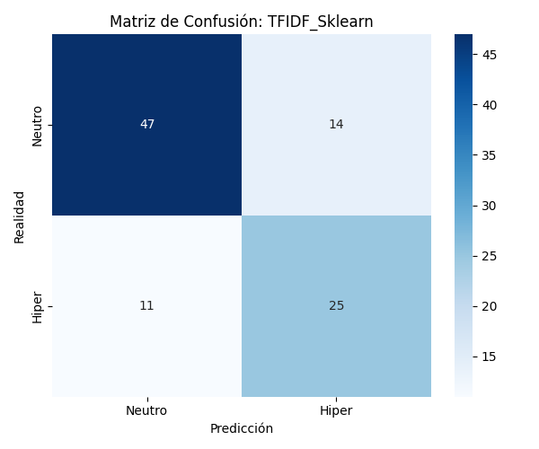
  
</p>

<!--
-->


##### 5.1.3.2 Resultados TF-IDF + Red neuronal (PyTorch)
<p align="center">
  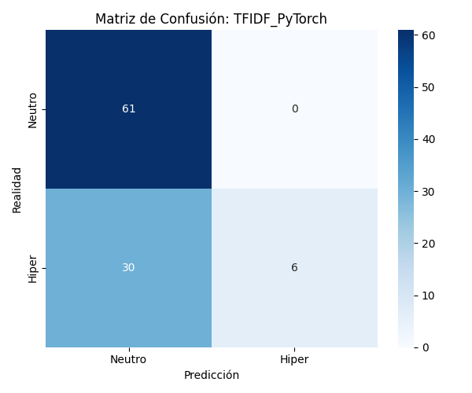
  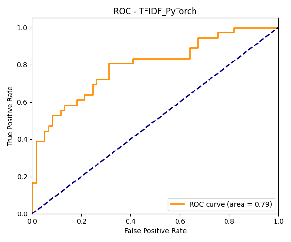
</p>
<!--
-->

##### 5.1.3.3 Resultados TF-IDF + Red neuronal (PyTorch) con Early Stopping
<p align="center">
  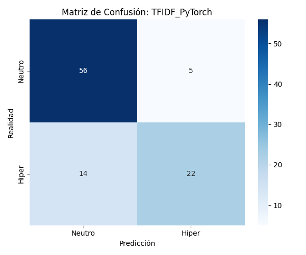
  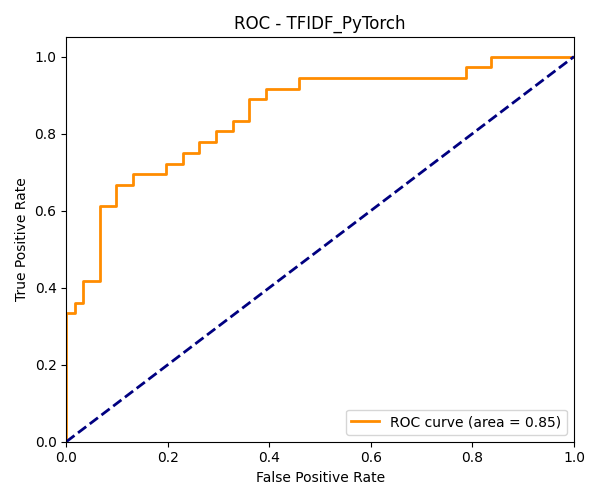
</p>
<!--
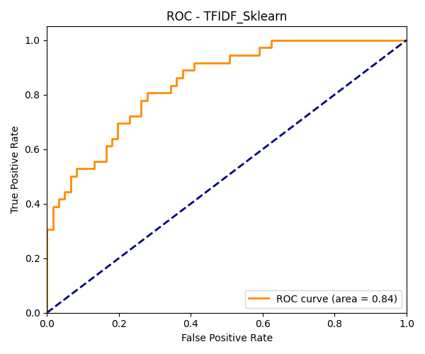-->

Durante el entrenamiento del modelo TF-IDF + PyTorch con un máximo de 200 épocas, se observa la siguiente evolución:

- En las primeras épocas, tanto la pérdida de entrenamiento como la pérdida de validación disminuyen de forma progresiva, lo que indica que el modelo está aprendiendo patrones relevantes a partir de los datos.

- A partir de aproximadamente la época 40, la pérdida de entrenamiento continúa disminuyendo de forma significativa, mientras que la pérdida de validación empieza a estabilizarse, mostrando una mejora cada vez más marginal.

- En la época 48, el mecanismo de early stopping detecta que la pérdida de validación deja de mejorar de manera consistente y detiene el entrenamiento de forma automática.

- El modelo recupera los pesos correspondientes a la mejor época en validación, garantizando así el mejor compromiso entre ajuste y generalización.

Este comportamiento confirma la presencia de un incipiente sobreajuste a partir de las últimas épocas, donde el modelo sigue optimizando el conjunto de entrenamiento sin lograr mejoras equivalentes en validación.

- Métricas de error:

| Época | Train Loss | Val Loss |
|------:|-----------:|---------:|
| 10 | 0.6762 | 0.6822 |
| 20 | 0.6135 | 0.6517 |
| 30 | 0.4830 | 0.6055 |
| 40 | 0.3076 | 0.5732 |

*Early Stopping:* activado en época *48*

Se ha conseguido un *accuracy* TFIDF + Sklearn de 0.7423 y, TFIDF + PyTorch de 0.8041 

#### 5.1.4 Conclusiones

El uso de early stopping en la red neuronal basada en TF-IDF permite mejorar notablemente el equilibrio entre clases, aumentando la detección de contenido hiperpartidista y reduciendo el sobreajuste.
Este ajuste se refleja en una ROC-AUC ≈ 0.85, comparable al modelo clásico, y en una matriz de confusión más balanceada.
En conjunto, early stopping demuestra ser una técnica clave para estabilizar el entrenamiento en arquitecturas neuronales simples.

### 5.2. Word2Vec preentrenado (Google News) y clasificación

En esta fase se utiliza una segunda estrategia de representación vectorial basada en Word2Vec, empleando embeddings preentrenados sobre Google News. El objetivo es pasar de una representación dispersa basada en frecuencias (TF-IDF) a una representación densa y semántica, donde palabras con significados similares tienden a ocupar posiciones cercanas en el espacio vectorial.

#### 5.2.1 Carga del modelo Word2Vec (Google News)

Se carga el modelo word2vec-google-news-300, un modelo preentrenado de gran tamaño (≈ 1.6 GB) que proporciona vectores de 300 dimensiones para palabras del vocabulario. Al tratarse de un modelo preentrenado, no se ajustan los embeddings durante el proyecto: se reutilizan directamente como fuente de información semántica.

#### 5.2.2 Vectorización de documentos a partir de embeddings de palabras

Como Word2Vec produce vectores por palabra, se requiere convertir cada noticia completa en un único vector de tamaño fijo. Para ello, se implementa una representación a nivel de documento basada en el promedio (mean pooling) de los embeddings de sus palabras:

- El texto se tokeniza con nltk.word_tokenize tras pasarlo a minúsculas.

- Se filtran los tokens, quedándose solo con las palabras que están presentes en el vocabulario del modelo.

- Se calcula la media de los embeddings de las palabras válidas.

Caso especial implementado: si un documento no contiene ninguna palabra presente en el modelo, se asigna un vector de ceros de dimensión 300. Esto garantiza que todos los documentos tienen representación válida y comparable.


#### 5.2.3 Modelos evaluados con Word2Vec

Para mantener la comparabilidad experimental con TF-IDF, se evalúan dos clasificadores diferentes sobre la misma representación Word2Vec.

**A. Word2Vec + Regresión Logística (Scikit-learn)**

Se entrena un clasificador lineal de Regresión Logística sobre los vectores Word2Vec de 300 dimensiones, con la siguiente configuración:

- max_iter = 1000
- class_weight = "balanced" (para compensar posibles desbalances de clase)
- random_state = 42 (reproducibilidad)

El modelo genera probabilidades para la clase hiperpartidista y se evalúa con las mismas métricas del pipeline: Accuracy y ROC-AUC, además de guardar matriz de confusión y curva ROC.

**B. Word2Vec + Red neuronal (PyTorch) con Early Stopping**

Como alternativa no lineal, se entrena una red neuronal feed-forward en PyTorch usando los embeddings Word2Vec como entrada:

- Dimensión de entrada (input_dim): 300
- Entrenamiento con un máximo de 200 épocas
- Early Stopping activado con patience = 5, utilizando explícitamente el conjunto de validación para detener el entrenamiento si la pérdida de validación deja de mejorar y recuperar automáticamente el mejor modelo.

Este enfoque permite comprobar si, sobre una representación semántica densa como Word2Vec, un clasificador no lineal mejora el rendimiento frente al clasificador lineal.

#### 5.2.4 Visualización de la arquitectura (diagrama de red)

Adicionalmente, se genera un diagrama de la arquitectura de la red neuronal utilizada con Word2Vec mediante torchviz y graphviz. Para ello se crea una instancia de la red con entrada de 300 dimensiones y se propaga un input ficticio (dummy input).


El diagrama generado muestra la arquitectura interna de la red neuronal utilizada con Word2Vec, así como el flujo de operaciones que PyTorch emplea durante el entrenamiento. La red recibe como entrada un vector de 300 dimensiones, correspondiente al embedding Word2Vec de cada documento, y lo procesa a través de dos capas ocultas. La primera capa transforma la entrada de 300 a 128 neuronas, y la segunda reduce la representación de 128 a 64 neuronas, aplicando en ambos casos una función de activación ReLU para introducir no linealidad. Finalmente, una capa de salida de 1 neurona con activación sigmoide produce un único valor entre 0 y 1, que se interpreta como la probabilidad de que la noticia sea hiperpartidista.

Además de las capas y activaciones, el diagrama refleja cómo PyTorch organiza internamente los cálculos necesarios para el aprendizaje. Los bloques asociados a los pesos y sesgos de cada capa indican los parámetros entrenables del modelo, mientras que los nodos intermedios representan las operaciones matemáticas que permiten calcular los gradientes durante la retropropagación del error. Aunque el grafo puede parecer complejo, su función principal es documentar que el modelo sigue una estructura 300 → 128 → 64 → 1, coherente con la arquitectura definida, y que el entrenamiento se realiza correctamente mediante backpropagation.

#### 5.2.5 Evaluación, artefactos y almacenamiento de resultados

Para ambas variantes (Scikit-learn y PyTorch) se generan automáticamente:

- Matriz de confusión
- Curva ROC

Los resultados se almacenan en una estructura común para facilitar la comparación con TF-IDF y con las fases posteriores del proyecto.
##### 5.2.5.1 Resultados Word2Vec + Regresión Logística (Scikit-learn)
<p align="center">
  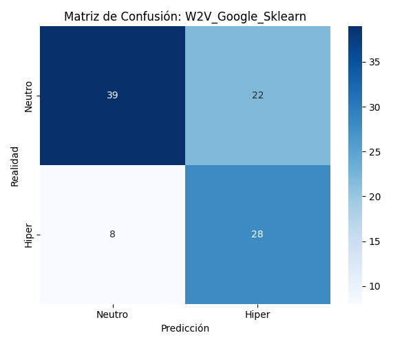
  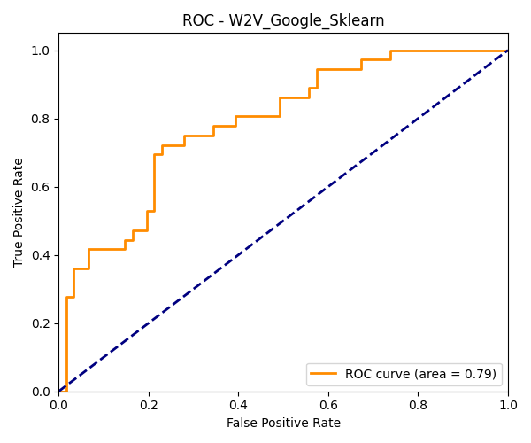
</p>

##### 5.2.5.2 Resultados Word2Vec + Red neuronal (PyTorch)
<p align="center">
  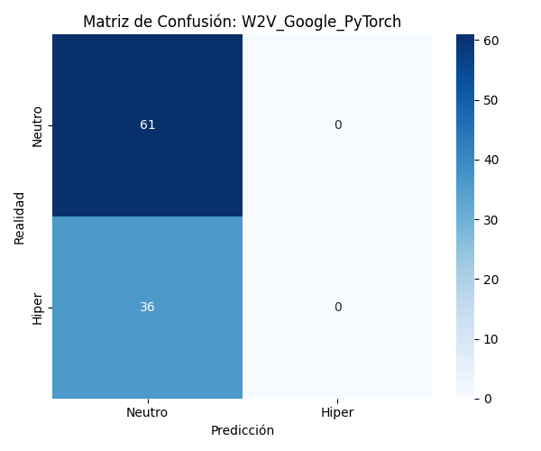
  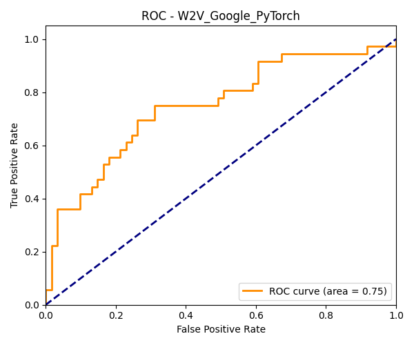
</p>
<p align="center">
  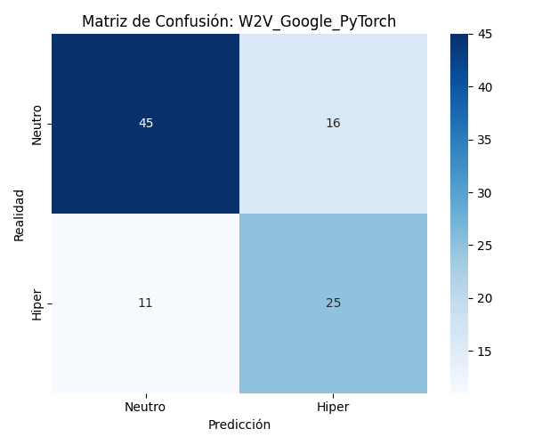
  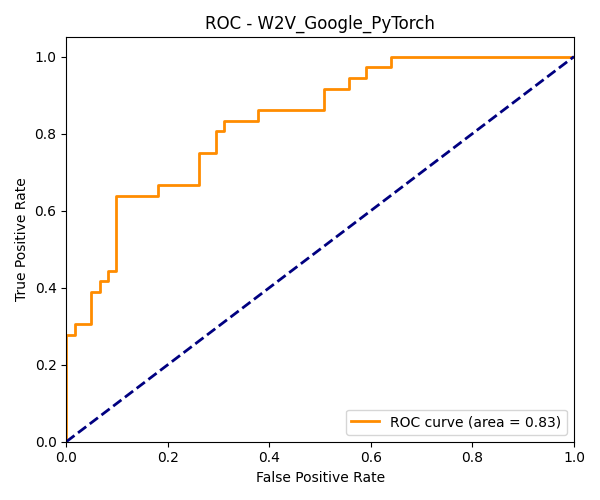
</p>
- Métricas de error:

| Época | Train Loss | Val Loss |
|------:|-----------:|---------:|
| 10 | 0.6621 | 0.6624 |
| 20 | 0.6519 | 0.6561 |
| 30 | 0.6395 | 0.6434 |
| 40 | 0.6180 | 0.6201 |
| 50 | 0.5770 | 0.5877 |
| 60 | 0.5449 | 0.5695 |
| 70 | 0.5045 | 0.5627 |
| 80 | 0.4737 | 0.5548 |
| 90 | 0.4489 | 0.5469 |
| 100 | 0.4266 | 0.5378 |
| 110 | 0.3955 | 0.5327 |
| 120 | 0.3867 | 0.5337 |

*Early Stopping:* activado en época *121*
Se ha conseguido un *accuracy* W2V_Google + Sklearn de 0.6907 y, W2V_Google + PyTorch de 0.7216


### 5.3. Embeddings contextuales con BERT (DistilBERT)

En esta fase se emplea una representación del texto basada en embeddings contextuales obtenidos mediante un modelo Transformer preentrenado. Concretamente, se utiliza DistilBERT, una versión más ligera de BERT que mantiene gran parte de su capacidad representacional con un menor coste computacional.

El objetivo de esta fase es evaluar si una representación contextual, capaz de tener en cuenta el significado de las palabras en función de su contexto, mejora la detección de noticias hiperpartidistas frente a representaciones estáticas como TF-IDF o Word2Vec.

#### 5.3.1 Modelo utilizado: DistilBERT

Se emplea el modelo distilbert-base-uncased, preentrenado sobre grandes corpus de texto en inglés mediante tareas de modelado del lenguaje. Sus principales características son:

- Tipo de modelo: Transformer encoder
- Uso de atención para capturar dependencias contextuales
- Dimensión del embedding: 768
- Texto en minúsculas (uncased)
- Modelo preentrenado, sin ajuste adicional de sus pesos (no fine-tuning)

En esta fase, DistilBERT se utiliza exclusivamente como extractor de características, no como clasificador end-to-end.

#### 5.3.2 Extracción de embeddings a nivel de documento

Cada texto se procesa individualmente mediante el tokenizador de DistilBERT, que convierte el texto en tokens compatibles con el modelo. Para controlar el coste computacional y asegurar una longitud uniforme, se aplica:

- Truncado a un máximo de 256 tokens
- Padding automático
- Procesamiento en modo inferencia (no_grad), sin cálculo de gradientes

A partir de la salida del modelo, se extrae el embedding correspondiente al token [CLS], que actúa como una representación global del documento. Este vector tiene 768 dimensiones y se utiliza como representación final del texto.

#### 5.3.3 Modelos evaluados con embeddings BERT

Al igual que en las fases anteriores, se evalúan dos enfoques de clasificación sobre los embeddings extraídos con BERT, manteniendo la coherencia experimental.

**A. BERT Embeddings + Regresión Logística (Scikit-learn)**

En primer lugar, se entrena un modelo de Regresión Logística utilizando como entrada los embeddings BERT de 768 dimensiones.

Configuración principal del clasificador:

- Número máximo de iteraciones: 1000
- Pesos de clase balanceados
- Semilla fija para reproducibilidad

Este enfoque permite evaluar hasta qué punto la información contextual capturada por BERT es separable mediante un clasificador lineal.

**B. BERT Embeddings + Red neuronal (PyTorch) con Early Stopping**

Como alternativa no lineal, se entrena una red neuronal feed-forward en PyTorch utilizando los embeddings BERT como entrada.

Características del entrenamiento:

- Dimensión de entrada: 768
- Número máximo de épocas: 100
- Early stopping activado con patience = 5

Uso explícito del conjunto de validación para detener el entrenamiento y recuperar el mejor modelo

Este enfoque permite analizar si una arquitectura neuronal sencilla es capaz de explotar mejor la riqueza semántica de los embeddings contextuales.

#### 5.3.4 Evaluación y objetivo comparativo

Ambos modelos se evalúan sobre el conjunto de test utilizando las mismas métricas que en el resto del proyecto:

Además, se generan automáticamente:

- Matrices de confusión
- Curvas ROC

##### 5.3.4.1 Resultados BERT + Regresión Logística (Scikit-learn)
<p align="center">
  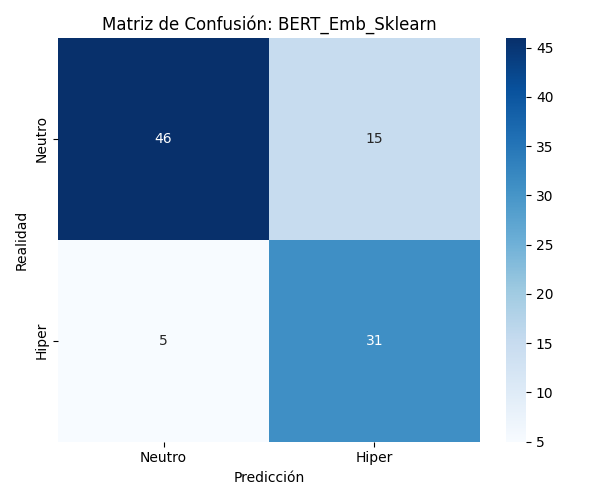
  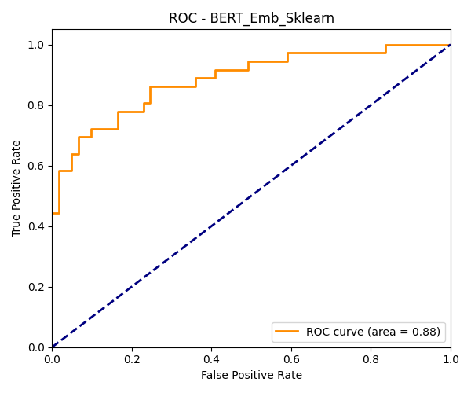
</p>

##### 5.3.4.1 Resultados BERT + Red neuronal (PyTorch)
<p align="center">
  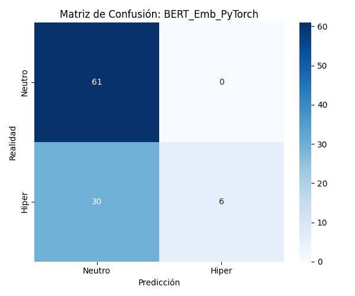
  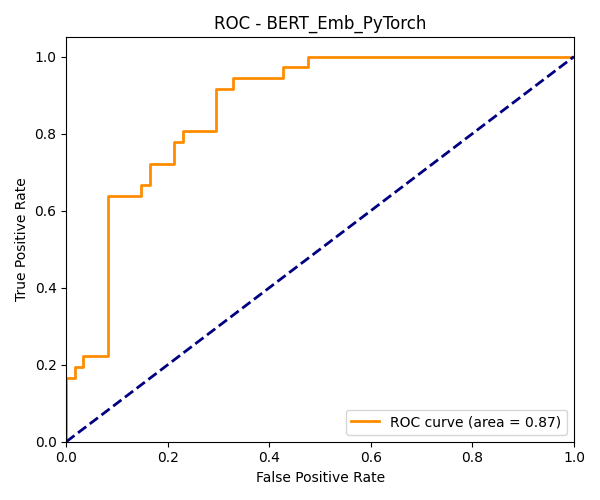
</p>
<p align="center">
  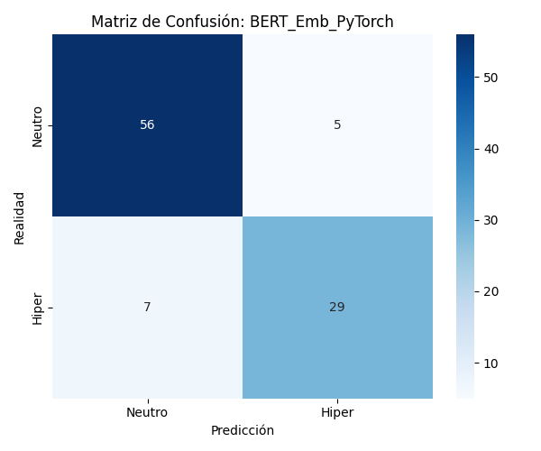
  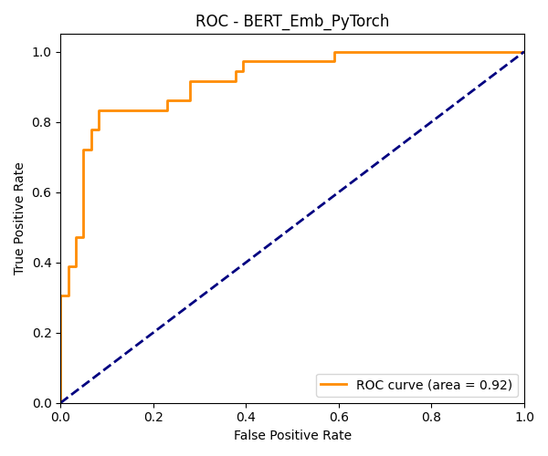
</p>

- Métricas de error:

| Época | Train Loss | Val Loss |
|------:|-----------:|---------:|
| 10 | 0.6242 | 0.6176 |
| 20 | 0.5447 | 0.5397 |
| 30 | 0.4604 | 0.5024 |
| 40 | 0.4304 | 0.4827 |
| 50 | 0.3845 | 0.4700 |

*Early Stopping:* activado en época *55*

## 6. Fase 3 - FineTunning (RoBERTa)

El fine-tuning del modelo RoBERTa se configura mediante TrainingArguments, utilizando una tasa de aprendizaje baja (2e-5), habitual en modelos Transformer, y regularización mediante weight decay para reducir el sobreajuste.
El entrenamiento se realiza durante un máximo de 20 épocas, evaluando y guardando el modelo al final de cada una.

La métrica principal seleccionada para la optimización es F1 macro, más adecuada que la accuracy en presencia de desbalance entre clases. El mejor modelo se recupera automáticamente al finalizar el entrenamiento.

Durante el entrenamiento y la validación se evalúan accuracy y F1 macro.
Adicionalmente, se implementa un Trainer personalizado que incorpora pesos de clase en la función de pérdida (CrossEntropyLoss), penalizando con mayor intensidad los errores en la clase minoritaria.

Se aplica early stopping con una paciencia de cinco épocas. El entrenamiento se detiene automáticamente si la métrica F1 no mejora, evitando sobreajuste y reduciendo el coste computacional.

### 6.1 Resultados RoBERTa

Se generan dos visualizaciones para facilitar la interpretación de los resultados: matriz de confusión y curva ROC

<p align="center">
  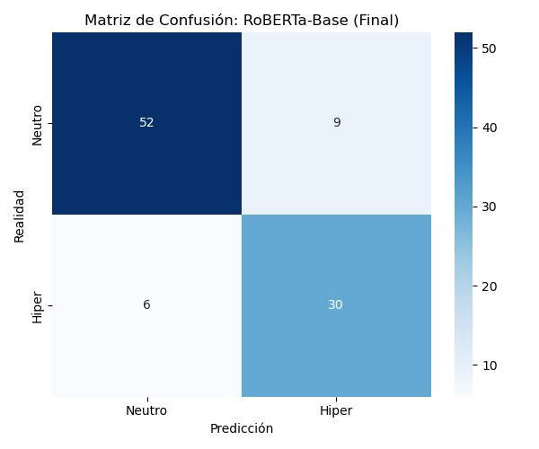
  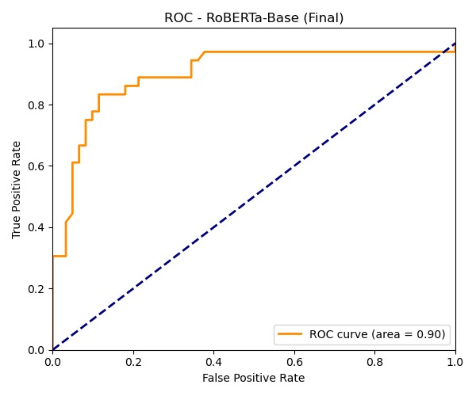
</p>

-Métricas de error:

| Epoch | Training Loss | Validation Loss | Accuracy | F1 |
|------:|--------------:|----------------:|---------:|----:|
| 1 | 0.495700 | 0.402782 | 0.819277 | 0.802788 |
| 2 | 0.393400 | 0.491681 | 0.855422 | 0.852837 |
| 3 | 0.225300 | 0.931068 | 0.771084 | 0.710376 |
| 4 | 0.325900 | 0.906247 | 0.819277 | 0.792119 |
| 5 | 0.174300 | 0.474258 | 0.903614 | 0.898284 |
| 6 | 0.007900 | 0.747138 | 0.867470 | 0.855378 |
| 7 | 0.047900 | 1.176057 | 0.831325 | 0.811364 |
| 8 | 0.000400 | 0.772608 | 0.855422 | 0.843396 |
| 9 | 0.000300 | 0.783316 | 0.891566 | 0.884882 |
| 10 | 0.000200 | 1.080631 | 0.855422 | 0.840996 |

| Clase | Precision | Recall | F1-score | Support |
|------|----------:|-------:|---------:|--------:|
| Neutro | 0.92 | 0.77 | 0.84 | 61 |
| Hiper | 0.70 | 0.89 | 0.78 | 36 |
| *Accuracy* |  |  | *0.81* | *97* |
| Macro Avg | 0.81 | 0.83 | 0.81 | 97 |
| Weighted Avg | 0.84 | 0.81 | 0.82 | 97 |


##    7. Comparación final de modelos

| Modelo | Accuracy | AUC-ROC |
|------|---------:|--------:|
| TFIDF + Sklearn | 0.7423 | 0.8438 |
| TFIDF + PyTorch | 0.8041 | 0.8506 |
| W2V Google + Sklearn | 0.6907 | 0.7855 |
| W2V Google + PyTorch | 0.7216 | 0.8320 |
| BERT Embeddings + Sklearn | 0.7938 | 0.8848 |
| *BERT Embeddings + PyTorch* | *0.8763* | *0.9158* |

Accuracy de RoBERTa: 0.81
AUC-ROC de RoBERTa: 0.9

En la comparación global de modelos se observa una clara mejora del rendimiento a medida que se emplean representaciones semánticas más ricas y arquitecturas más expresivas. Los enfoques basados en TF-IDF ofrecen un rendimiento competitivo como línea base, destacando especialmente la implementación en PyTorch, que supera a su equivalente en Scikit-learn tanto en accuracy como en AUC-ROC. Los modelos basados en Word2Vec presentan un rendimiento inferior, lo que indica que el promedio de embeddings estáticos no captura adecuadamente el contexto semántico de las noticias. Al incorporar embeddings contextuales de BERT, el rendimiento mejora de forma notable, especialmente en términos de AUC-ROC, reflejando una mayor capacidad discriminativa del modelo. La mejor combinación corresponde a BERT Embeddings + PyTorch, que alcanza la mayor accuracy (0.8763) y el AUC-ROC más alto (0.9158), confirmando la ventaja de combinar representaciones contextuales con modelos neuronales entrenables. Por su parte, RoBERTa, ajustado mediante fine-tuning completo, obtiene resultados competitivos (accuracy ≈ 0.81, AUC-ROC ≈ 0.90), situándose por encima de la mayoría de enfoques clásicos y confirmando la eficacia de los Transformers, aunque en este caso sin superar a la mejor configuración basada en embeddings BERT y PyTorch.

##    8. Fase 4 - Extensión del proyecto

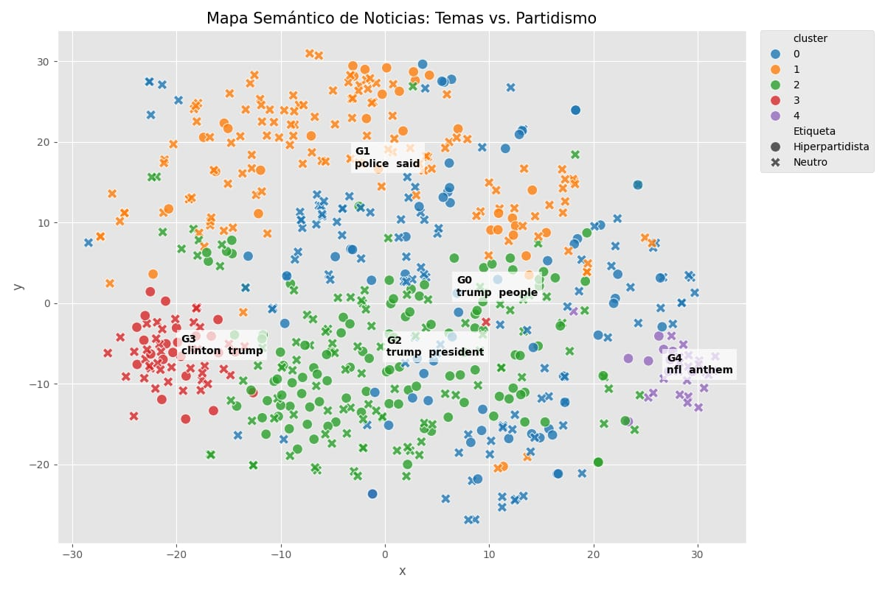

| Grupo | Palabras clave principales |
|------:|----------------------------|
| 0 | trump, people, president, said, hurricane |
| 1 | police, said, people, paddock, man |
| 2 | trump, president, clinton, said, people |
| 3 | clinton, trump, fbi, comey, hillary |
| 4 | nfl, anthem, trump, players, said |

| Cluster | Hiperpartidista (%) | Neutro (%) |
|-------:|--------------------:|-----------:|
| 0 | 36.5 | 63.5 |
| 1 | 20.2 | 79.8 |
| 2 | 50.9 | 49.1 |
| 3 | 36.5 | 63.5 |
| 4 | 30.3 | 69.7 |

El análisis de clustering revela que la polarización no es uniforme:

Mientras que la política general (Grupo 2: Trump vs. Clinton) el 51% de las noticias son hiperpartidistas, los eventos de sucesos trágicos (Grupo 1: Tiroteo de Las Vegas) muestran una resistencia a la desinformación, con un 80% de cobertura neutra.

Esto sugiere que las campañas de desinformación son selectivas y atacan prioritariamente los temas donde la división política ya existe (elecciones), mientras que tienen menos tracción en eventos puramente factuales o trágicos.


##    9. Conclusión
En este proyecto se ha construido un pipeline completo y reproducible para la detección automática de contenido hiperpartidista, abarcando desde técnicas clásicas de PLN hasta modelos Transformer avanzados. Los resultados muestran que los enfoques basados en TF-IDF proporcionan un baseline sólido, aunque su rendimiento mejora al emplear arquitecturas neuronales. Por el contrario, Word2Vec presenta resultados más limitados, lo que evidencia las carencias de los embeddings estáticos para capturar el contexto ideológico. El uso de embeddings contextuales con DistilBERT, especialmente combinado con una red neuronal en PyTorch, ofrece el mejor rendimiento global, mientras que el fine-tuning de RoBERTa alcanza resultados competitivos y confirma la eficacia de los Transformers para esta tarea. Finalmente, la extensión de clustering temático revela que la polarización no es uniforme y se concentra en determinados tópicos, reforzando la idea de que el hiperpartidismo depende en gran medida del tema tratado.